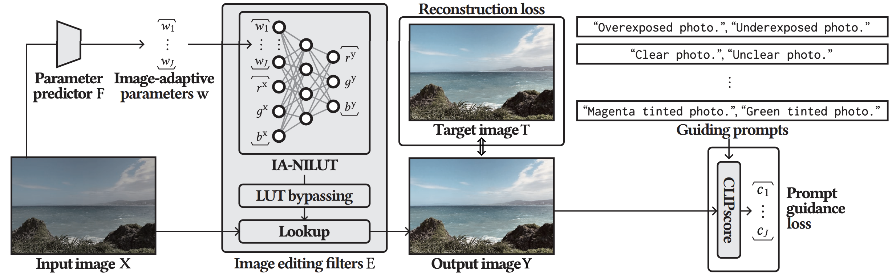
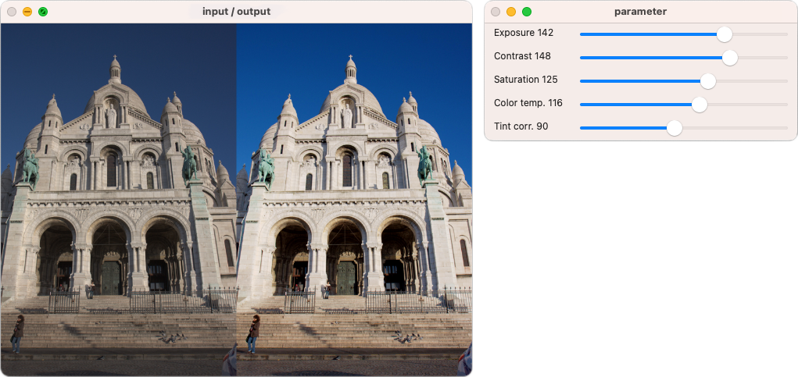

# Prompt-Guided Image-Adaptive Neural Implicit Lookup Tables for Interpretable Image Enhancement

This is the official implementation of the paper in ACM Multimedia 2024. [[paper](https://arxiv.org/abs/2408.11055)]

<p align="left">

</p>

## Code Structure
This code is primarily based on [AdaInt](https://github.com/ImCharlesY/AdaInt/tree/main). The most significant modification is in `adaint/model.py`.

- `mmedit/`: MMEditing toolbox. Some modifications are made to use CLIP based on [CLIP-IQA](https://github.com/IceClear/CLIP-IQA).
- `adaint/`: the core implementation of the paper, including:
  - `annfiles/`: including the annotation files for FiveK and PPR10K datasets.
  - `dataset.py`: the dataset class (FiveK and PPR10K).
  - `transforms.py`: including some augmentations not provided by MMEditing toolbox.
  - `ailut_transform/`: the implementation of the Lookup function.
  - `model.py`: the implementation of the IA-NILUT and the prompt guidance loss.
  - `configs/`: including configurations to conduct experiments.
- `pretrained/`: including the pretrained models.


## Requirements
- Python 3.7.11
- CUDA 11.3

Install the Python libraries:
```Shell
conda install pytorch==1.11.0 torchvision==0.12.0 cudatoolkit=11.3 -c pytorch
pip install mmcv-full==1.6.0 -f https://download.openmmlab.com/mmcv/dist/cu113/torch1.11.0/index.html
pip install -r requirements.txt
```
Set up the MMEditing toolbox:
```Shell
pip install -v -e .
```

Compile and install the extension:
```Shell
python adaint/ailut_transform/setup.py install
```


## Datasets

The paper uses the [FiveK](https://data.csail.mit.edu/graphics/fivek/) and [PPR10K](https://github.com/csjliang/PPR10K) datasets for experiments. It is recommended to refer to the dataset creators first using the above two urls.

The preparation of the datasets followed the procedures outlined in [AdaInt](https://github.com/ImCharlesY/AdaInt/tree/main). Please refer to that source for details.


## Usage

### Training
Our training is divided into three stages.

- The first training step
```Shell
(FiveK) python tools/train.py adaint/configs/fivekrgb_first.py
(PPR10K) python tools/train.py adaint/configs/ppr10k_a_first.py
```

- The second training step
```Shell
(FiveK) python tools/train.py adaint/configs/fivekrgb_second.py
(PPR10K) python tools/train.py adaint/configs/ppr10k_a_second.py
```


- The third training step
  - Before conducting the third training step, please check the log file from the second training step (`work_dirs/pg_ia_nilut_fivekrgb_second/XXX.log` or `work_dirs/pg_ia_nilut_ppr10k_a_second/XXX.log`). Find the model with the best PSNR and set its path as `pretrained_PG_IA_NILUT_path` in `adaint/configs/fivekrgb_third.py` or `adaint/configs/ppr10k_a_third.py`.
```Shell
(FiveK) python tools/train.py adaint/configs/fivekrgb_third.py
(PPR10K) python tools/train.py adaint/configs/ppr10k_a_third.py
```

### Testing
We provide pretrained models in `./pretrained/`. To conduct testing, please use the following commands:
```Shell
(FiveK) python tools/test.py adaint/configs/fivekrgb_third.py pretrained/fivekrgb.pth --save-path [PATH/TO/SAVE/RESULTS]
(PPR10K) python tools/test.py adaint/configs/ppr10k_a_third.py pretrained/ppr10k_a.pth --save-path [PATH/TO/SAVE/RESULTS]
```
If you want to visualize the filter effects, please use the `--visualize` option:
```Shell
(FiveK) python tools/test.py adaint/configs/fivekrgb_third.py pretrained/fivekrgb.pth --save-path [PATH/TO/SAVE/RESULTS] --visualize
(PPR10K) python tools/test.py adaint/configs/ppr10k_a_third.py pretrained/ppr10k_a.pth --save-path [PATH/TO/SAVE/RESULTS] --visualize
```

## Demo
We provide demo codes for a CPU machine. It is assumed that this code is executed in a different environment from the one above.
You need to install libraries for demo.

Install the Python libraries:
```Shell
pip install torch==1.11.0 torchvision==0.12.0 --extra-index-url https://download.pytorch.org/whl/cpu
pip install mmcv-full==1.6.0 -f https://download.openmmlab.com/mmcv/dist/cpu/torch1.11.0/index.html
pip install -r requirements_demo.txt
```
Set up the MMEditing toolbox:
```Shell
pip install -v -e .
```

Compile and install the extension:
```Shell
python adaint/ailut_transform/setup_demo.py install
```

To run the demo, please use the following command:
```Shell
python tools/demo.py pretrained/fivekrgb.pth resources/a3433.jpg
```

The following windows will be displayed.
<p align="center">

</p>

## Acknowledgements
Our implementation is based on the following codes. We would like to thank them.

- [AdaInt](https://github.com/ImCharlesY/AdaInt/tree/main)
- [MMEditing](https://github.com/open-mmlab/mmediting)
- [CLIP-IQA](https://github.com/IceClear/CLIP-IQA)


## Citation
If you find our research useful in your research, please consider citing:
```Shell
@inproceedings{kosugi2024prompt,
    title={Prompt-Guided Image-Adaptive Neural Implicit Lookup Tables for Interpretable Image Enhancement},
    author={Kosugi, Satoshi},
    booktitle={ACM Multimedia},
    year={2024}
}
```
